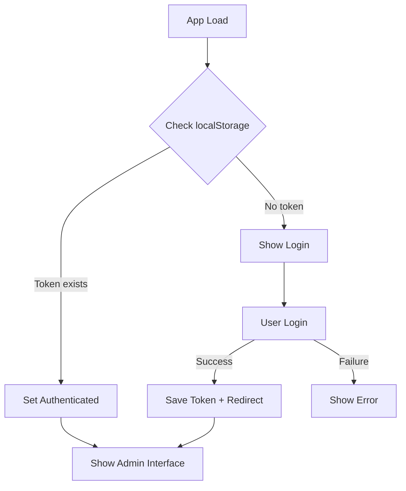
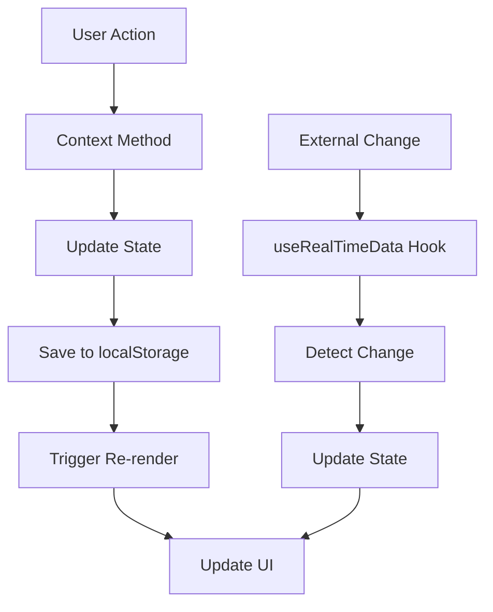

# 🔧 Guia Técnico - RoboRace Frontend

## 🏗️ Arquitetura de Componentes

### Hierarquia de Componentes
```
App
├── AuthProvider
│   └── DataProvider
│       ├── PublicView (rota /view)
│       └── AppContent
│           ├── Login (não autenticado)
│           └── Layout (autenticado)
│               ├── Sidebar
│               ├── Header Mobile
│               └── Pages
│                   ├── Teams
│                   ├── Groups
│                   ├── Matches
│                   ├── Ranking
│                   └── Admin
```

## 📊 Estruturas de Dados

### Team
```javascript
{
  id: number,           // Timestamp único
  name: string,         // Nome da equipe (único)
  createdAt: string     // ISO timestamp
}
```

### Group
```javascript
{
  id: number,           // Timestamp único
  name: string,         // Nome do grupo
  teams: Array<Team>,   // Equipes do grupo
  createdAt: string     // ISO timestamp
}
```

### Match
```javascript
{
  id: number,           // Timestamp único
  team1: Team,          // Primeira equipe
  team2: Team,          // Segunda equipe
  status: 'pending' | 'completed',
  winner: Team | null,  // Equipe vencedora
  draw: boolean,        // Se foi empate
  phase: string,        // Nome da fase
  phaseType: string,    // Tipo da fase (groups, round16, etc.)
  createdAt: string,    // ISO timestamp
  completedAt?: string  // ISO timestamp quando finalizada
}
```

### Ranking
```javascript
{
  team: Team,           // Referência da equipe
  points: number,       // Pontos totais
  wins: number,         // Número de vitórias
  draws: number,        // Número de empates
  losses: number,       // Número de derrotas
  position: number,     // Posição no ranking
  group: string         // Nome do grupo
}
```

## 🔄 Fluxos de Estado

### Fluxo de Autenticação


### Fluxo de Dados


## 🎯 Padrões de Desenvolvimento

### Context Pattern
```javascript
// Criação do contexto
const DataContext = createContext();

// Provider com estado e métodos
export const DataProvider = ({ children }) => {
  const [data, setData] = useState(initialData);
  
  const addTeam = (team) => {
    // Lógica de adição
    setData(prev => ({ ...prev, teams: [...prev.teams, newTeam] }));
  };
  
  return (
    <DataContext.Provider value={{ ...data, addTeam }}>
      {children}
    </DataContext.Provider>
  );
};

// Hook customizado para uso
export const useData = () => {
  const context = useContext(DataContext);
  if (!context) {
    throw new Error('useData deve ser usado dentro de DataProvider');
  }
  return context;
};
```

### Estado Imutável
```javascript
// ❌ Mutação direta
data.teams.push(newTeam);

// ✅ Atualização imutável
setData(prev => ({
  ...prev,
  teams: [...prev.teams, newTeam]
}));
```

### Persistência Automática
```javascript
// Salvar automaticamente no localStorage
useEffect(() => {
  localStorage.setItem(STORAGE_KEY, JSON.stringify(data));
}, [data]);
```

## 🔍 Algoritmos Principais

### Cálculo de Ranking
```javascript
const calculateRankings = (currentData) => {
  const teamStats = {};
  
  // 1. Inicializar estatísticas
  currentData.teams.forEach(team => {
    teamStats[team.id] = {
      team, points: 0, wins: 0, draws: 0, losses: 0
    };
  });
  
  // 2. Processar partidas concluídas
  currentData.matches
    .filter(match => match.status === 'completed')
    .forEach(match => {
      if (match.draw) {
        // Empate: 1 ponto para cada
        teamStats[match.team1.id].points += 1;
        teamStats[match.team2.id].points += 1;
        teamStats[match.team1.id].draws += 1;
        teamStats[match.team2.id].draws += 1;
      } else {
        // Vitória: 3 pontos para vencedor
        const winnerId = match.winner.id;
        const loserId = winnerId === match.team1.id ? match.team2.id : match.team1.id;
        
        teamStats[winnerId].points += 3;
        teamStats[winnerId].wins += 1;
        teamStats[loserId].losses += 1;
      }
    });
  
  // 3. Ordenar por critérios
  return Object.values(teamStats)
    .sort((a, b) => {
      if (b.points !== a.points) return b.points - a.points;     // Pontos
      if (b.wins !== a.wins) return b.wins - a.wins;           // Vitórias
      return a.losses - b.losses;                              // Derrotas
    })
    .map((stats, index) => ({ ...stats, position: index + 1 }));
};
```

### Geração de Chaves por Grupos
```javascript
const generateGroupBrackets = () => {
  const newMatches = [];
  let matchId = Date.now();
  
  data.groups.forEach(group => {
    if (group.teams.length >= 2) {
      // Algoritmo de combinações: C(n,2) = n×(n-1)/2
      for (let i = 0; i < group.teams.length; i++) {
        for (let j = i + 1; j < group.teams.length; j++) {
          newMatches.push({
            id: matchId++,
            team1: group.teams[i],
            team2: group.teams[j],
            status: 'pending',
            phase: group.name,
            phaseType: 'groups'
          });
        }
      }
    }
  });
  
  return newMatches;
};
```

## 🎨 Sistema de Estilos

### Convenções TailwindCSS
```javascript
// Cores do sistema
const colors = {
  primary: '#2DA63F',      // bg-[#2DA63F]
  secondary: '#A7D9AE',    // bg-[#A7D9AE]
  success: '#41A650',      // bg-[#41A650]
  background: '#FAFCFB'    // bg-[#FAFCFB]
};

// Classes padrão para componentes
const buttonClasses = {
  primary: 'px-4 py-2 bg-[#2DA63F] text-white rounded-md hover:bg-[#41A650]',
  secondary: 'px-4 py-2 bg-gray-600 text-white rounded-md hover:bg-gray-700',
  danger: 'px-4 py-2 bg-red-600 text-white rounded-md hover:bg-red-700'
};
```

### Componentes Reutilizáveis
```javascript
// Card padrão
const Card = ({ children, className = '' }) => (
  <div className={`bg-white rounded-lg shadow p-6 ${className}`}>
    {children}
  </div>
);

// Button com variantes
const Button = ({ variant = 'primary', children, ...props }) => (
  <button className={buttonClasses[variant]} {...props}>
    {children}
  </button>
);
```

## 🔄 Gerenciamento de Estado

### Estado Local vs Global
```javascript
// ✅ Estado local para UI
const [isModalOpen, setIsModalOpen] = useState(false);
const [searchTerm, setSearchTerm] = useState('');

// ✅ Estado global para dados de negócio
const { teams, addTeam, removeTeam } = useData();
```

### Otimização de Performance
```javascript
// Memoização de cálculos pesados
const expensiveValue = useMemo(() => {
  return calculateComplexRanking(teams, matches);
}, [teams, matches]);

// Callback memoizado
const handleAddTeam = useCallback((team) => {
  addTeam(team);
}, [addTeam]);
```

## 🔍 Debugging e Logs

### Estrutura de Logs
```javascript
// Logs estruturados
const logger = {
  info: (message, data) => console.log(`[INFO] ${message}`, data),
  error: (message, error) => console.error(`[ERROR] ${message}`, error),
  debug: (message, data) => console.debug(`[DEBUG] ${message}`, data)
};

// Uso nos contextos
const addTeam = (team) => {
  try {
    logger.info('Adding team', { teamName: team.name });
    // Lógica de adição
    logger.info('Team added successfully', { teamId: newTeam.id });
  } catch (error) {
    logger.error('Failed to add team', error);
  }
};
```

### DevTools Integration
```javascript
// React DevTools - nomeação de contextos
DataContext.displayName = 'DataContext';
AuthContext.displayName = 'AuthContext';

// Debugging de estado
useEffect(() => {
  if (process.env.NODE_ENV === 'development') {
    console.log('Data state updated:', data);
  }
}, [data]);
```

## 🚀 Otimizações

### Code Splitting
```javascript
// Lazy loading de páginas
const Teams = lazy(() => import('./pages/Teams'));
const Groups = lazy(() => import('./pages/Groups'));

// Suspense wrapper
<Suspense fallback={<LoadingSpinner />}>
  <Teams />
</Suspense>
```

### Bundle Analysis
```bash
# Analisar bundle size
npm run build
npx vite-bundle-analyzer dist
```

## 🧪 Testing Strategy

### Estrutura de Testes (Recomendada)
```
src/
├── __tests__/
│   ├── components/
│   ├── context/
│   ├── hooks/
│   └── pages/
├── __mocks__/
└── test-utils/
```

### Testes de Contexto
```javascript
// Exemplo de teste para DataContext
import { renderHook, act } from '@testing-library/react';
import { DataProvider, useData } from '../context/DataContext';

const wrapper = ({ children }) => (
  <DataProvider>{children}</DataProvider>
);

test('should add team correctly', () => {
  const { result } = renderHook(() => useData(), { wrapper });
  
  act(() => {
    result.current.addTeam({ name: 'Test Team' });
  });
  
  expect(result.current.teams).toHaveLength(1);
  expect(result.current.teams[0].name).toBe('Test Team');
});
```

## 🔒 Segurança

### Sanitização de Inputs
```javascript
const sanitizeInput = (input) => {
  return input.trim().replace(/[<>]/g, '');
};

const addTeam = (team) => {
  const sanitizedName = sanitizeInput(team.name);
  // Continuar com nome sanitizado
};
```

### Validação de Dados
```javascript
const validateTeam = (team) => {
  const errors = [];
  
  if (!team.name || team.name.trim().length === 0) {
    errors.push('Nome é obrigatório');
  }
  
  if (team.name.length > 50) {
    errors.push('Nome muito longo');
  }
  
  return errors;
};
```

---

**Guia técnico para desenvolvedores**  
*Jeremias O Nunes - 2025*